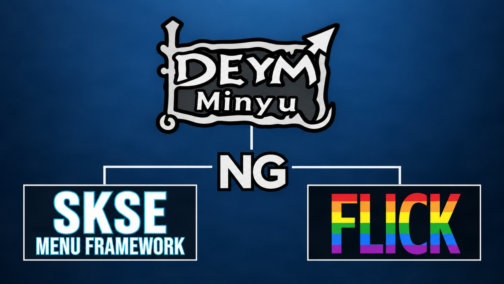
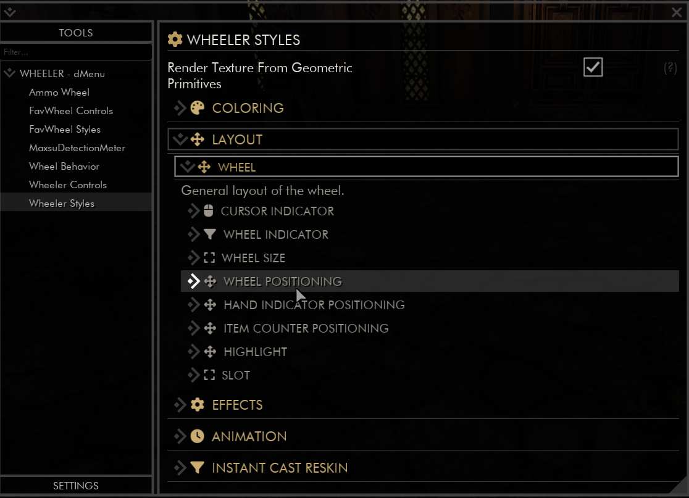
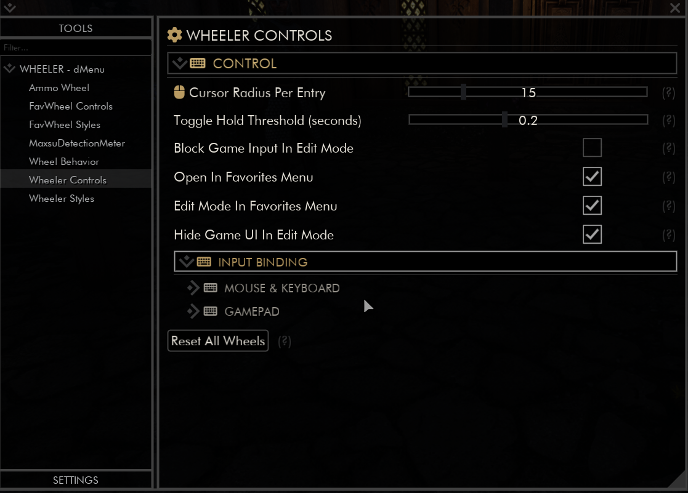
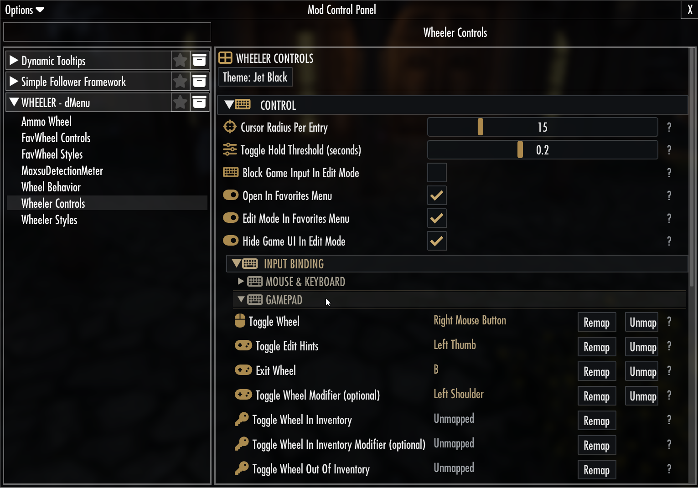
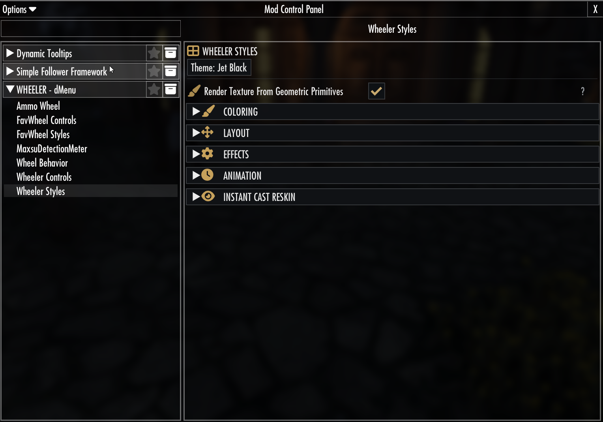

# dMenu NG

<p align="center">
  
</p>

<p align="center">
  An unofficial modern standalone DLL update of dTry/D7ry's dMenu for Skyrim SE/AE, with expanded input, configuration and integration capabilities.
</p>

<p align="center">
  <a href="https://www.nexusmods.com/skyrimspecialedition/mods/166751"></a>
  <a href="https://github.com/c0kadam/dmenu-NG/tags"></a>
  <a href="#building-from-source"></a>
  <a href="https://github.com/c0kadam/dmenu-NG/issues"></a>
  <a href="LICENSE"></a>
</p>

> [!IMPORTANT]
> Get end-user downloads and installation support from [Nexus Mods](https://www.nexusmods.com/skyrimspecialedition/mods/166751). A GitHub source checkout is not a complete player installation. Original dMenu is still required for its base assets and content; dMenu NG replaces and extends the DLL/runtime portion.

## What is dMenu NG?

dMenu NG updates the standalone DLL for [dMenu](https://github.com/D7ry/dMenu),
originally created by dTry/D7ry. It retains the original dMenu asset setup while
adding support for modern Skyrim SE/AE runtimes, improving controller and text
input, and expanding custom settings pages and their configuration options.

This is an independent, unofficial project, not an official continuation or an
endorsement by dTry/D7ry. This repository provides source, API documentation,
and reference build instructions. Normal player installation starts with the
original dMenu and the dMenu NG package from Nexus Mods.

## Highlights

| Area | dMenu NG capabilities |
| --- | --- |
| Compatibility and stability | CommonLibSSE-NG port for modern SE/AE runtimes; strict startup callsite validation preserves compatible pre-existing SKSE hook chains. Crash and safety fixes cover AIM spawning, settings handling, and newer game versions. |
| Controller and input | Gamepad navigation, separate gamepad toggle/modifier bindings, and a gamepad hint toggle. |
| Text entry and IME | Native IME input for Chinese, Japanese, and Korean text fields, plus a built-in on-screen keyboard for controller text entry. |
| Localisation and fonts | Translations through `Data/SKSE/Plugins/dMenu/translations.txt`, improved glyph coverage, and custom font support. |
| Custom settings | Expanded custom mod settings functionality, including grid layouts. |
| Settings frontends | Native dMenu settings with optional FLICK and SKSE Menu Framework frontends using the same settings model. |
| Media and hints | Animated custom-settings previews using flipbook, GIF, WebP, and WebM media. |
| INI persistence | Safer saving edits existing INI files instead of rebuilding them from scratch. |
| External API | A versioned interface lets other SKSE plugins open, close, toggle, and query dMenu without simulating a hotkey. |

## Integration Overview

Choose the interface that fits your setup. Native dMenu is always available;
the two external frontends are optional and can be installed together.

| Frontend | Requirement | Purpose |
| --- | --- | --- |
| Native dMenu | Built-in standard interface; normal dMenu asset setup | Browse and edit custom settings directly in dMenu. |
| [FLICK](https://github.com/Fuzzlesz/FUCK) | Optional; install FLICK separately | Access the same parsed custom-settings pages through [FLICK's interface](#flick). |
| [SKSE Menu Framework 3](https://github.com/QTR-Modding/SKSE-Menu-Framework-3) | Optional; install SKSE Menu Framework separately | Access the same settings through the [Mod Control Panel](#skse-menu-framework-3). |

## Optional Settings Frontends

**dMenu custom settings remain the canonical settings model.** FLICK and SKSE
Menu Framework are alternate interfaces to those settings. They operate on
the same dMenu settings and target INIs, with the existing dMenu persistence
behavior; they do not create separate configuration stores.

Neither framework is bundled with dMenu NG or hard-linked into `dmenu.dll`.
Native dMenu remains usable when both are absent, and either or both can be
installed alongside it. The integrations discover the frameworks through
their public APIs.

The screenshots below show example custom settings pages supplied by other
mods and presented through dMenu NG's integrations. Click a screenshot to view
its original size.

### FLICK

With [FLICK](https://github.com/Fuzzlesz/FUCK) installed, dMenu NG exposes its
parsed custom-settings pages through FLICK while retaining dMenu's existing
settings and INI persistence behavior. These examples show Wheeler Styles and
Wheeler Controls pages.

<p align="center">
  <a href="images/dmenu/dmenu-flick-1.png"></a>
  <a href="images/dmenu/dmenu-flick-2.png"></a>
</p>

### SKSE Menu Framework 3

With [SKSE Menu Framework 3](https://github.com/QTR-Modding/SKSE-Menu-Framework-3)
installed, the same dMenu settings are available in its Mod Control Panel.
Changes use the shared settings model and the same target INIs as native
dMenu. These examples show Wheeler Controls with gamepad bindings and Wheeler
Styles with grouped settings. The integration uses the framework's
[public API](https://github.com/QTR-Modding/SKSE-Menu-Framework-3-API).

<p align="center">
  <a href="images/dmenu/dmenu-sksemf-1.png"></a>
  <a href="images/dmenu/dmenu-sksemf-2.png"></a>
</p>

## Installation Layout

Install the original dMenu first, then let dMenu NG overwrite the plugin files.
Nexus runtime archives include the compiled plugin; the source repository does not
track `dmenu.dll`. The installed layout should include:

```text
Data/SKSE/Plugins/dmenu.dll
Data/SKSE/Plugins/dMenu/dmenu.defaults.ini
Data/SKSE/Plugins/dMenu/hint_media.ini
Data/SKSE/Plugins/dMenu/translations.txt
Data/SKSE/Plugins/dMenu/customSettings/...
Data/SKSE/Plugins/dMenu/docs/...
Data/SKSE/Plugins/dMenu/hints/...
```

Keep dMenu NG below the original dMenu mod in your mod manager so this DLL takes
priority. The dMenu NG archive contains its DLL and the NG runtime additions
listed above; it does not redistribute the original mod's base assets.

For localisation support, make sure the included `translations.txt` file is
present in:

```text
Data/SKSE/Plugins/dMenu/translations.txt
```

## External API For Mod Authors

dMenu NG includes a small versioned API for SKSE plugins that need to open,
close, toggle, or check dMenu without simulating the configured hotkey.

Public header:

```text
src/include/dmenu_api.h
```

Main exported functions:

```text
dMenu_OpenMenu()
dMenu_CloseMenu()
dMenu_ToggleMenu()
dMenu_IsMenuOpen()
dMenu_IsReady()
dMenu_SetMenuOpen(bool open)
dMenu_GetApiVersion()
dMenu_GetInterface(uint32_t requestedVersion)
```

See [README_dmenu_api.md](README_dmenu_api.md) for the SKSE messaging and export
lookup examples.

## Requirements

- Visual Studio 2022 with the C++ desktop workload
- CMake 3.22 or newer
- vcpkg
- [CommonLibSSE-NG 7.2.0](https://github.com/alandtse/CommonLibSSE-NG/releases/tag/v7.2.0),
  checked out at `7a60f4de794095d7b0f8928d1b930a52e9a7da83`
- Address Library for SKSE Plugins with the database matching the installed
  Skyrim executable (1.7.99 and 1.7.104 use Address Library format 5)

| Skyrim runtime | Matching SKSE |
| --- | --- |
| 1.5.97 | 2.0.20 |
| 1.6.1170 | 2.2.6 |
| 1.7.99 | 2.3.0 |
| 1.7.104 | 2.3.1 |

Set these environment variables before configuring:

```powershell
$env:VCPKG_ROOT = "C:\Path\To\vcpkg"
$env:CommonLibSSEPath_NG = "C:\Path\To\CommonLibSSE-NG"
```

The configure step checks both the CommonLibSSE-NG version and exact Git
revision. Supported Skyrim runtimes are 1.5.97, 1.6.1170, 1.7.99, and 1.7.104;
other versions fail closed before any hooks are installed.

## Building from Source

Configure without copying the output anywhere:

```powershell
cmake --preset vs2022-windows -DCOPY_OUTPUT=OFF
```

Build the plugin:

```powershell
cmake --build build --config Release
```

To build and run the runtime compatibility regression tests, configure with
`-DDMENU_BUILD_TESTS=ON`, then run:

```powershell
cmake --build build --config Release --target dmenu_runtime_compatibility_tests
ctest --test-dir build -C Release --output-on-failure
```

The DLL is written to:

```text
build/src/Release/dmenu.dll
```

To copy the build output into a mod staging folder automatically, set
`CompiledPluginsPath` to the mod root and configure with `COPY_OUTPUT=ON`:

```powershell
$env:CompiledPluginsPath = "C:\Path\To\Your\Mod"
cmake --preset vs2022-windows -DCOPY_OUTPUT=ON
```

## License

dMenu NG as a combined project is distributed under `GPL-3.0-or-later` with the
CommonLibSSE-NG Modding Exception and GPL-3.0 Linking Exception (with
Corresponding Source).
This licensing applies because the plugin statically links CommonLibSSE-NG
7.2.0. See [LICENSE](LICENSE), [EXCEPTIONS.md](EXCEPTIONS.md), and
[NOTICE.md](NOTICE.md) for the complete terms and attribution.

[LICENSES/](docs/LICENSING.md) preserves license texts for specifically
identified upstream, API, and dependency components. The component-specific
MIT, LGPL, and GPL terms apply to those identified components. Their presence
does not mean the complete dMenu NG project is triple-licensed or offered
under every license in that directory.

The original D7ry/dMenu source was released under MIT. Its original copyright
and license text are preserved in
[LICENSES/D7ry-dMenu-MIT.txt](LICENSES/D7ry-dMenu-MIT.txt). CommonLibSSE-NG
license provenance is preserved under [LICENSES](LICENSES/).

The public interoperability header `src/include/dmenu_api.h` is separately
available under MIT so other SKSE plugins can include the ABI declaration. See
[LICENSES/dMenu-API-MIT.txt](LICENSES/dMenu-API-MIT.txt). The API implementation
compiled into `dmenu.dll` remains part of the GPL-licensed project.

Binary distributors must provide the Corresponding Source required by these
terms. The reproducible dependency identity used by this project is
CommonLibSSE-NG 7.2.0 at commit
`7a60f4de794095d7b0f8928d1b930a52e9a7da83`.

Each binary release should therefore be accompanied by a source archive that
contains the exact dMenu NG release source and build files, the exact pinned
CommonLibSSE-NG source, and the source/build material for the non-System static
and header-only dependencies incorporated into the DLL. Repository links,
version numbers, and commit hashes are useful provenance and reproducibility
metadata, but are not substitutes for the source archive.

## Credits / Permissions

dMenu NG is a modified derivative of the original dMenu mod by dTry/D7ry.

- dMenu by dTry/D7ry
- GitHub: https://github.com/D7ry/dMenu
- Original source licensed under the MIT License

This project is not affiliated with or endorsed by dTry/D7ry. All original
credits remain with the original author and contributors.

Thanks to dTry for creating the original mod and open-sourcing the code, and to
the authors and maintainers of CommonLibSSE-NG, Dear ImGui, SimpleIni, spdlog,
xbyak, nlohmann/json, rapidcsv, rsm-binary-io, fast-cpp-csv-parser, and the
other libraries used by the project.

dMenu NG optionally integrates with these projects through their public APIs.

- [FLICK](https://github.com/Fuzzlesz/FUCK) by Fuzzlesz.
- [SKSE Menu Framework 3](https://github.com/QTR-Modding/SKSE-Menu-Framework-3)
  by QTR-Modding, with its
  [public API](https://github.com/QTR-Modding/SKSE-Menu-Framework-3-API).

SimpleIME compatibility was validated with
[SimpleIME 2.2.1](https://github.com/cyfewlp/SimpleIME) by cyfewlp [JamieYin101](https://www.nexusmods.com/profile/JamieYin101). SimpleIME
is installed separately and is not bundled with or linked into dMenu NG.

Thanks to [Risasre22](https://github.com/Risasre22) [risarei](https://www.nexusmods.com/profile/risarei) for the external API
integration request and compatibility feedback.

See [LICENSE](LICENSE) and [NOTICE.md](NOTICE.md) for license and attribution
details.
